# Hands-on Lab 2: Spreadsheet Basics

**Estimated time needed:** 20 minutes

To get started with a spreadsheet app, you need to know:

```
Some of the common terminology around it
What its key features are
How to use some basic tools on the ribbon
How to move around a worksheet
How to select data in it.
```
In this lab, you will go through some basic spreadsheet elements, explore the ribbon, navigate around a worksheet and select data.

# Software Used in this Lab

The instruction videos in this course use the full Excel Desktop version as this has all the available product features, but for the hands-on labs we will
be using the free ‘Excel for the web’ version as this is available to everyone.

Although you can use the Excel Desktop software if you have access to this version, it is recommended that you use Excel for the web for the hands-on
labs as the lab instructions specifically refer to this version, and there are some small differences in the interface and available features.

# Dataset Used in this Lab

The dataset used in this lab comes from the following source: https://www.kaggle.com/sudalairajkumar/indian-startup-funding under a **CC0: Public
Domain license**.
Acknowledgement and thanks also goes to https://trak.in who were generous enough to share the data publicly for free.

We are using a modified subset of that dataset for the lab, so to follow the lab instructions successfully please use the dataset provided with the lab,
rather than the dataset from the original source.

# Objectives

After completing this lab, you will be able to:

```
- Understand and use the basic elements of a spreadsheet.

- Explore the ribbon, navigate around a worksheet and select data.
```
# Exercise 1: Introduction to Basic Spreadsheet Elements

In this exercise, you will learn about some common spreadsheet elements.

1. Open **Excel for the web**. Click on **New blank workbook**.

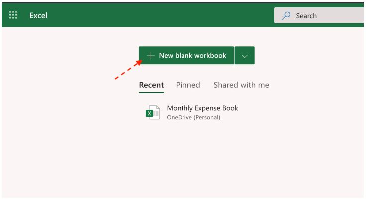

2. The new blank workbook will automatically be saved in Excel for the web as **Book**. To rename the workbook to something more meaningful,
    click **File** , **Save As** , then choose **Rename**.

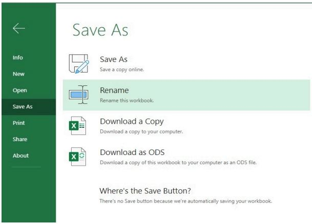

3. In the file name box, type **Personal_Monthly_Expenditure_Lab2** and click **OK**.

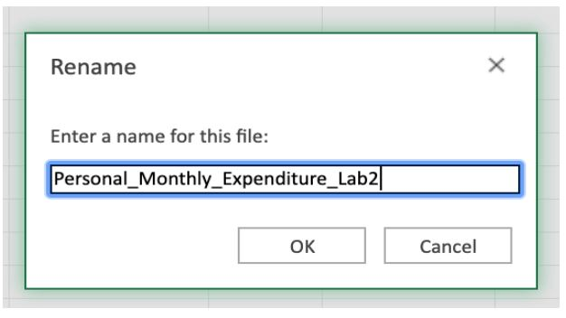

4. In the saved workbook, you will have one worksheet opened, named _Sheet1_. Click **+** once to add another worksheet. Then, double-click the sheet
    name tab for **Sheet1** and rename it to **Expense - 2019**. Similarly, rename **Sheet2** as **Expense - 2018**.

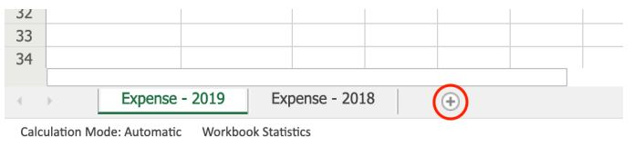

5. To maintain an appropriate worksheet tab sequence, click on the worksheet tab **Expense - 2018** , then drag and drop it before the **Expense - 2019**
    tab.

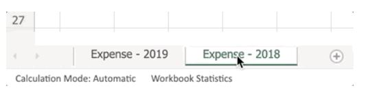

6. Click on the **Expense - 2018** tab. Select an entire column by clicking on **B** in the top of the worksheet, then select an entire row by clicking on
    the number **5** in the left of the worksheet. Click cell **B5** , and a green outline will appear around the cell. Now check if you have clicked the
    correct cell by looking at the cell name box in the top left corner, circled in red below.

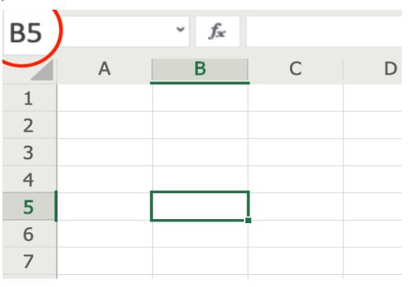

7. Select several cells in the same row, such as A1:D1 by clicking cell **A1** and then drag the cursor across to **D1**. Similarly, select a cell range in the
    same column, such as A1:A5 by clicking **A1** and dragging the cursor down to **A**.

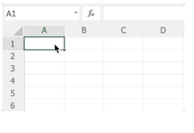

8. Now select a cell range which includes several rows and columns together, such as A1:C5 by clicking **A1** and then dragging the cursor across
    and down to cell **C**.

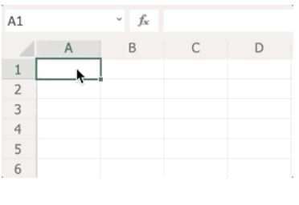

# Exercise 2: Explore the Ribbon, Navigate around a Worksheet, and

# Select Data

In this exercise, you will explore the ribbon, then navigate around a worksheet, and select data.

## Task A: Explore the ribbon

1. Download the file **indian_startup_funding_Lab2.xlsx**.
2. To open a sample file in Excel for the web, click the **App Launcher** (cube of dots) in the top left corner. Click **Excel** , and then click **Upload and**
    **open...** and select the **indian_startup_funding_Lab2.xlsx** file.

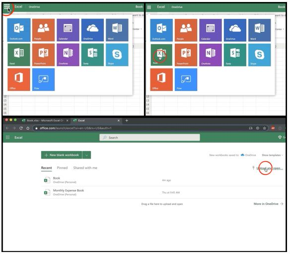

3. Click each of the following tabs in the ribbon; **File, Home, Insert, Formulas, Data, Review, View** to explore each of them and get acquainted
    with the ribbon. Double-click any of the tabs to hide the ribbon, then do the same again to unhide it.

## Task B: Navigate around a worksheet

1. Click on **any cell** and move around the worksheet using the arrow keys; **Up, Down, Left, Right**.

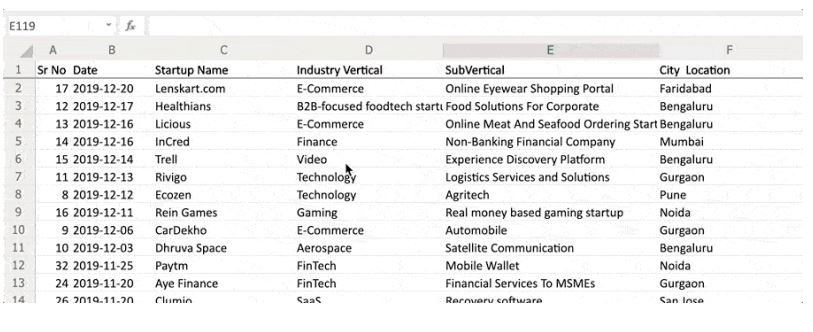

2. Click **Page Down** twice, and then **Page Up** twice to move around a bit faster, which is useful if you have lots of rows of data.


3. Click and drag the **horizontal scroll bar** and then the **vertical scroll bar** to move even quicker up, down, and across a large datasheet.
4. Try out these useful shortcuts in your worksheet:

```
Press CTRL+End to take you to the cell at the end of your data in the worksheet.
Press CTRL+Home to take you back to the start of the data in the worksheet (i.e. cell A2).
Press CTRL+Down Arrow to take you to the end of the column you’re in
Press CTRL+Up Arrow to take you back to the top of the column.
```
## Task C: Select data

Perform the following steps to learn how to select different parts of your data (you can use the mouse to select cells if you prefer):


1.
- To select cells in a single row: Select cell A1 , then select cells A1 to D1 by using SHIFT+right arrow.
- To select cells in a single column: Select cell A1 , then select cells A1 to A10 by using SHIFT+down arrow.

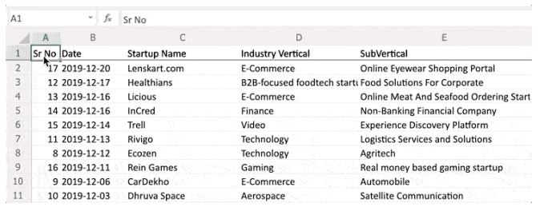

2. To select multiple contiguous cols/rows: Select column **A** , and use **SHIFT+ right arrow** to reach column **E**.
3. To select multiple non-contiguous cols/rows: Select column **A** , then hold **CTRL** and select column **E**.


4.
To select the entire worksheet: Click the corner button (small grey triangle in top left corner of the worksheet).
To select all your data: Select any cell in the data, then press CTRL+A.

```
Note: The first time you press CTRL+A, it selects the current region if the worksheet contains data, the second time it selects the current data
region and its header row, and the third time it selects the entire worksheet.
```

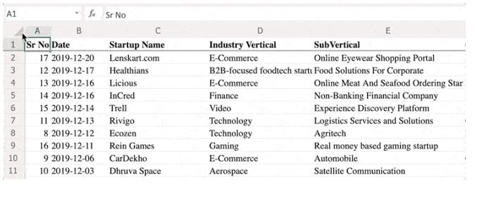

### Congratulations! You have completed Lab 2, and you are ready for the next topic.

# Author

```
Sandip Saha Joy
```

# Other Contributor(s)

```
Steve Ryan
```
### © IBM Corporation 2020. All rights reserved.


